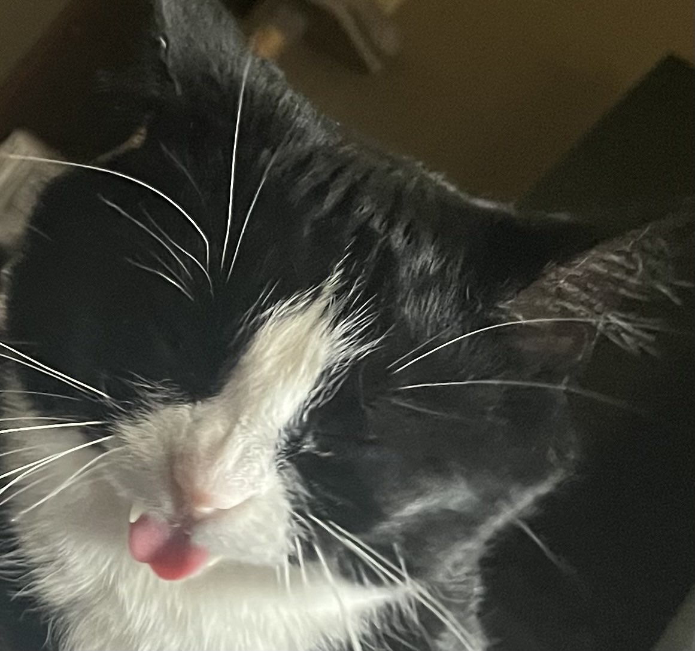

# Winston_Bot

Winston is a Twitch chat bot built around my wonderful cat. It connects to Twitch's EventSub WebSocket to listen for chat messages and responds to commands for moderation and Spotify song queue management.



## What it does

**Moderation** — Monitors chat for messages matching a banned phrases list and automatically bans the user. Handles edge cases like attempting to ban the broadcaster, mods, or any mod/bot conflicts.

**Song requests** — Chatters can request songs by posting a Spotify track link. The bot looks up the track, adds it to the streamer's queue, and responds with the success of failure of the request. It also handles edge cases where spotify is paused or not open.

**Chat commands**

| Command | Description |
|---|---|
| `!sr https://open.spotify.com/track/` | Add a song to the Spotify queue |
| `!song` | Show the currently playing song |
| `!next` | Show the next song in the queue |
| `!lurk` | Acknowledge a lurker in chat |
| Various fun hidden commands :] | I get bored |

## How it works

On startup, `main.py` loads Twitch and Spotify tokens via `handle_tokens`, then opens a persistent async WebSocket connection to `wss://eventsub.wss.twitch.tv/ws`. When the session welcome message arrives, the bot subscribes to scoped EventSub event types.

## Files

| File | Description |
|---|---|
| `main.py` | loads tokens and starts the WebSocket listener |
| `websocket_monitor.py` | EventSub connection and chat command routing logic |
| `twitch_calls.py` | Contains all twitch API related modules |
| `spotify_calls.py` | Contains all spotify API related modules |
| `auth.py` | Token loading and refresh logic |
| `auth_dataclass.py` | Config dataclass for Twitch and Spotify credentials |
| `banned_phrases.txt` | Line-separated list of phrases that trigger an auto-ban. I have left some common phrases, but it can be edited as needed. |

## Setup

### Prerequisites

- Python >= 3.12
- [`winston_shared`](https://github.com/cheecho92/winston_shared) installed
- Twitch and Spotify tokens generated using [`flask_server`](https://github.com/cheecho92/flask_server)

### Install

```bash
pip install -r requirements.txt
pip install -e /path/to/winston_shared
```

### Run

```bash
python main.py
```

## Related

- [`flask_server`](https://github.com/cheecho92/flask_server) — OAuth server that uses this package to handle auth flows and save tokens
- [`winston_shared`](https://github.com/cheecho92/winston_shared) — shared auth logic and tokens used by both services